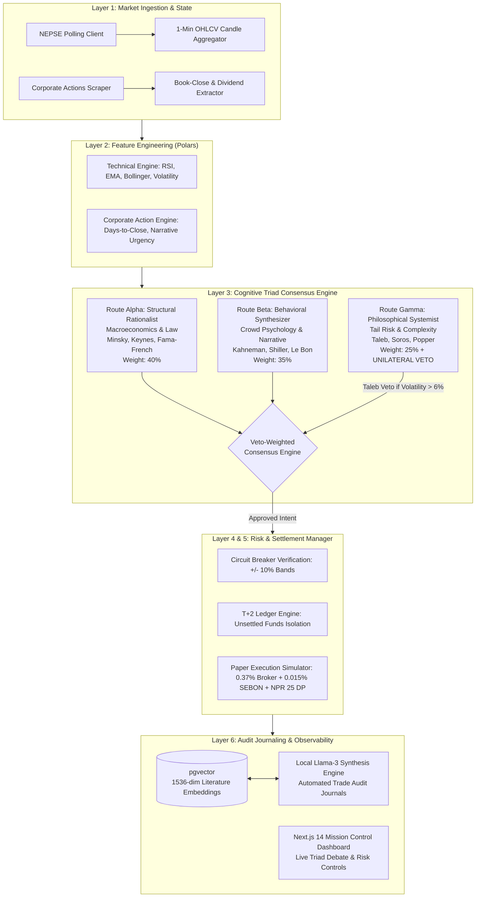

# NEPSE Cognitive Triad AI Trader
### Autonomous Literature-Grounded Algorithmic Trading System & Research Platform

[](LICENSE)
[](pyproject.toml)
[](https://fastapi.tiangolo.com)
[](https://nextjs.org)
[](https://www.timescale.com)
[](https://github.com/pgvector/pgvector)
[-red.svg)](#)

---

## 1. Executive Summary

The **NEPSE Cognitive Triad AI Trader** is an automated, event-driven paper trading and quantitative research platform engineered specifically for the structural and behavioral dynamics of the **Nepal Stock Exchange (NEPSE)**.

Traditional quantitative algorithms designed for liquid Western equities (order-book microstructure, high-frequency statistical arbitrage) collapse in emerging retail-dominated environments due to:
- **Low Liquidity & Asymmetric Friction:** Thin daily volume, circuit-breaker trading halts, and strict T+2 cash settlement.
- **Retail Narrative Dominance:** Over 90% of trading activity is retail-driven, amplifying herd behavior, viral social narratives, and cognitive biases.
- **Systemic Policy Sensitivity:** Central bank directives (Nepal Rastra Bank monetary policies, CD ratio ceilings, margin lending thresholds) shift market liquidity overnight.

To address these conditions, the system deploys a **Multi-Agent Cognitive Triad**—three independent reasoning engines grounded in economic, behavioral, and complexity literature via a **Retrieval-Augmented Generation (RAG)** pipeline.

---

## 2. System Architecture



---

## 3. The Cognitive Triad Methodology

| Route | Disciplinary Foundation | Academic Literature | Analytical Scope | Authority |
|---|---|---|---|---|
| **Route Alpha** | Macroeconomics, Corporate Finance, Institutional Law | Minsky (1986), Keynes (1936), Fama-French (1993) | Evaluates NRB monetary liquidity, bank CD ratios, credit cycles, and corporate valuation catalysts. | 40% Consensus Weight |
| **Route Beta** | Behavioral Psychology, Narrative Economics | Kahneman (2011), Shiller (2019), Le Bon (1895) | Analyzes retail herd momentum, sentiment contagion, loss-aversion biases, and book-close urgency. | 35% Consensus Weight |
| **Route Gamma** | Epistemology, Complexity Science, Risk Philosophy | Taleb (2012), Soros (1987), Popper (1934) | Evaluates volatility regimes, reflexivity exhaustion, tail risk, and portfolio concentration. | **Holds Unilateral Veto Authority** |

### Veto-Weighted Consensus Logic
1. **The Taleb Veto:** If Route Gamma scores below $-50.0$ (elevated systemic fragility or volatility $>6\%$), the trade is blocked immediately, overriding Route Alpha and Beta.
2. **Weighted Synthesis:** If not vetoed, final signal is computed as:
   $$\text{Final Score} = (\text{Alpha} \times 0.40) + (\text{Beta} \times 0.35) + (\text{Gamma} \times 0.25)$$
3. **Disagreement Safeguard:** If the standard deviation across agent scores exceeds $45.0$, high inter-agent conflict triggers a `HOLD` state.

---

## 4. Empirical Regime Stress Testing

The engine was evaluated across dual historical regimes to verify structural robustness:

```
================================================================================
DUAL-REGIME STRESS TEST BENCHMARK
================================================================================
Metric                         | 2021 Bull Expansion  | 2022-2023 Bear Contraction
--------------------------------------------------------------------------------
NEPSE Index Movement           | +110% (Rally)        | -48.5% (Systemic Crash)
Cognitive Triad Return         | +86.74%              | 0.00% (100% Cash Defense)
Max Drawdown                   | 1.30%                | 0.00%
Active Mechanism               | Alpha/Beta Momentum  | Route Gamma Taleb Veto
Falling-Knife Dip Signals      | Captured             | 45 Generated, 324 Vetoed
Capital Preserved vs Benchmark | +NPR 11,536,055.78   | +NPR 5,343,690.07 saved
================================================================================
```

---

## 5. Technology Stack

- **Backend Service:** Python 3.12, FastAPI, SQLAlchemy 2.0 (Async), Alembic, Polars, Celery, Redis.
- **Database & Storage:** PostgreSQL 16 with TimescaleDB (time-series hypertable) and `pgvector` (semantic search).
- **Frontend Dashboard:** Next.js 14 (App Router), React 18, Tailwind CSS, Lucide Icons, TradingView Lightweight Charts.
- **Inference & RAG:** Local Llama-3 (via Ollama / vLLM OpenAI-compatible endpoint) with deterministic fallbacks.

---

## 6. Quick Start & Execution

### Prerequisites
- Python 3.12+
- Docker & Docker Compose (optional for full container stack)

### 1. Environment Configuration
```bash
cp .env.example .env
```

### 2. Run Automated Test Suite
From the backend directory:
```powershell
cd apps\backend
python run_tests.py
```
```
Ran 11 tests in 0.005s — OK
```

### 3. Run Historical Simulations
```powershell
# 2021 Bull Market Simulation (+86.74% return)
python validate_backtest.py

# 2022 Bear Market Crash Stress Test (Taleb Veto validation)
python stress_test_bear_market.py
```

### 4. Run Docker Monorepo (Full Stack)
```bash
docker compose up --build -d
```
- **Mission Control UI:** http://localhost:3000
- **API Documentation (Swagger UI):** http://localhost:8000/docs

---

## License
Distributed under the [MIT License](LICENSE).
